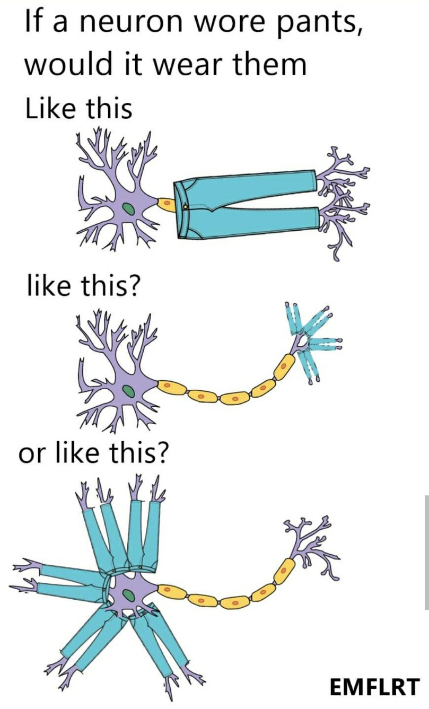

# Welcome!

This is my first personal web page, welcome!

# Who am I  

My name is Zhe Chen. It is kind of hard for English speakers to pronounce my name correctly. The pronunciation of "Zhe" sounds like when you are saying the "-dge" part in "Bridge", but lighter and quicker. I also have one nickname, Jack, and I am ok with both name. 

# Preference

Tea rather than coffee.
Cat rather than puppy.

# Werid interest

I am really interested in biology and like collecting interesting memes. This is one of my most favorite:

